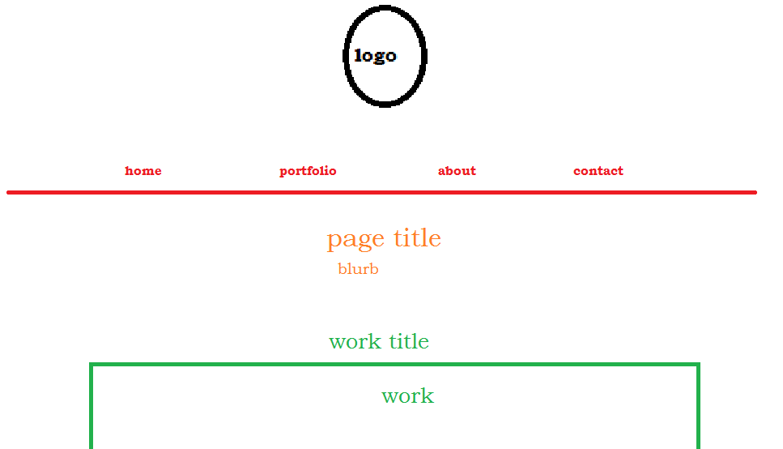
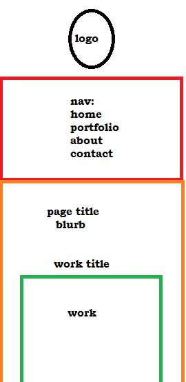

# Stephen Round
### MAR341 Final

---

For my final, I'm going to attempt to replicate from the ground up my [professional site](http://stephenrounddesign.com), which was something I joked about in week 11 but decided it would be an excellent challenge. The pro site was built with squarespace, which streamlined the entire process. I plan on adding web design to my repertoire of services, so being able to design entire sites without the use of site-building services will be beneficial for business.

 This is a basic layout for my site. A home button will lead to the front page, which will also be linked to my logo (the rough draft pictured to the right). I will also have a portfolio dropdown that contains all my categories of work. Next to that, an about page and a contact page.

Basically, if you want to see where the final product will end up, you can check the professional site. I'll try my best to end up with something very, very close. This will be akin to taking something crafted from an apprenticeship and attempting to recreate it like the master.

Large - Desktop

Medium - Smaller window or tablet

Small - Mobile

Obviously it won't look this heinous. This is a very rough placement of where everything will end up. The large wireframe bares the most resemblence to the final product.

---

I'll be honest, I built all of this site like a week ago. I've just been waiting to turn it in for a while. That's why this site exist in the work repo instead of the 341-final.

### The Process

The process was simple--just replicate my other site. However, this quickly became an journey in CSS and HTML relations. I had quite a few problems.

The first part obviously came in the form of creating the home page. I had already hard-coded the iframe for the official site, so plugging that in was easy enough. Then came putting in the images for my logo and signature that adorn the top and bottom of every page.

Originally, I just had the portfolio tab lead to the official site's portfolio, as I thought it'd be too many html files. I settled on the idea of building each portfolio tab since having it switch between sites was too confusing. At this point I added the little social icon for the original site underneath my signature.

The portfolio pages were easy as well since I also hard-coded those on the original site. For each page, I would copy the HTML for the header and footer, then fill the body with the relevant information. Since every header was the same, and used the same css stylesheet, I was able to keep a consistent look throughout each page.

I played around with the dropdown menu quite a bit. I discovered the @keyframes selector, and tried to make a menu that actually dropped down. This was frustrating since changing z-indexes would often not work and would even break my iframes (making them not interactive), so I decided to have it simply fade in, which was a much more elegant solution.

I ended up reading the Media Arts site after building the site, when I was down to completing the contact form. I'm glad I coincidentally followed the stipulations, and was even more elated that I didn't have to take a crash course in PHP to make my contact form.

There were a lot of problems with the about page, such as flex items simply not complying with the rules I set for them. I wanted to make it akin to the real site, with my picture on the left and info on the right, but it wasn't in the stars for me. Instead I settled on the picture on top and info on bottom.

This was a great exercise in building an actual website. I obviously wouldn't pass this out since I have the original for my work, but I might hide this project somewhere on there as an easter egg.
