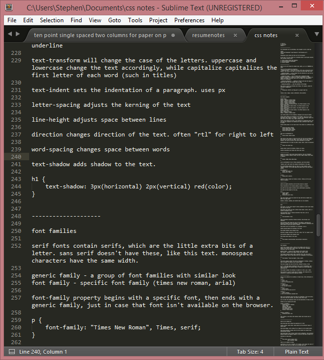

#### Week 8 - Diving into CSS
---
##### A snowy short story
  The fictional story I chose to place in this page was one I wrote for fun about a year ago. I originally put it up on my now-dead blog, but decided it'd be fun to dig up again and put back in the public eye, with a little more flair than before.

##### Notetaking...
  For this week, I plowed through the whole CSS reference sheet linked on the assignment website and took notes on all of it.

  

  So while I certainly have a good idea on how to implement all these properties in practice, I couldn't figure out a way that wouldn't look totally clunky and campy for this assignment. I embellished where I could; however, there were some things that, for a story page, couldn't make it. For the sake of cleanness and keeping it all homogenous, I didn't implement some requirements like pseudo-classes or imported fonts.

##### Decoration
  I created a small quick snowflake doodle for the background, to test background properties of images. It reminds me of older websites.

  I chose the blue color scheme for obvious reasons--it's indicative of winter, when the story takes place. Blues and whites make for a cool (as in cold) color scheme.

  I had a lot of trouble messing with the title headings, all because I was neglecting the difference between pixels(px) and points(pt). I eventually figured it out.

  The dotted lines between the passages were intentional, signaling a transition in time in the story. Originally, these were three asterisks, something that doesn't show up in HTML. In markdown, they make a line break similar to three hyphens.

  * * *

##### Conclusions on CSS

CSS is pretty easy after having a grasp on HTML. It's a fun way to style the blandness of default HTML. Atom's preview didn't show me any of the CSS when using an external sheet, so I had to push every time I made a change. 31 pushes in total, including this one with the readme.
