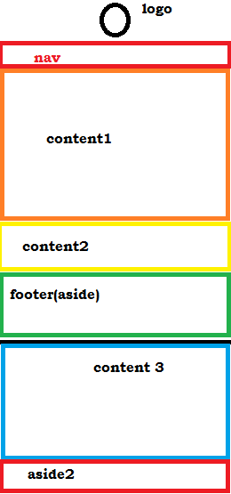
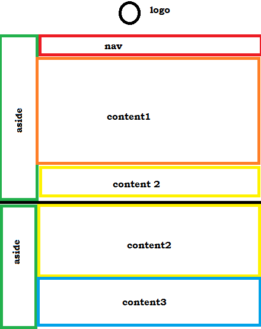
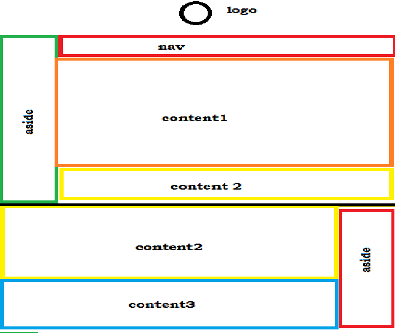

#### Week 10

---

##### What is responsive web design?
This page, being meta, will describe RWD while also using it. The first element of the page that shall be seen is the header, which will be my face icon. The primary content of this page is the RWD discussion. Secondary content is all the other assignments I've done, available through the navigation bar.

##### Repeat

I took the top part of last week's assignment to create this week's page, so that I would have more time to make sure the flexes worked. While I've been frustratingly trying to at least get the red box to be aside the pink boxes for the past three hours, at least I haven't had to worry about the site looking okay.

##### Sketches

I might have just misinterpreted how to make these site sketches with flexboxes. At first I did literal chicken-scratch sketches of a website for each type of device it would be viewed on, but now I've made simple mspaint sketches with actual flexboxes shown.

##### Playing with flexboxes

I've been struggling with flexboxes this week. I downloaded the example from the site, but playing around with it broke it. It didn't work after a while, even when I repaired the code back to its former state. I thought I had it working on the site proper, but I realized the text was automatically scaling with the window on my week 9 site too. [Here's](http://stephenround.github.io/341work/week-10-test/) the test site where I was playing with flexes.
